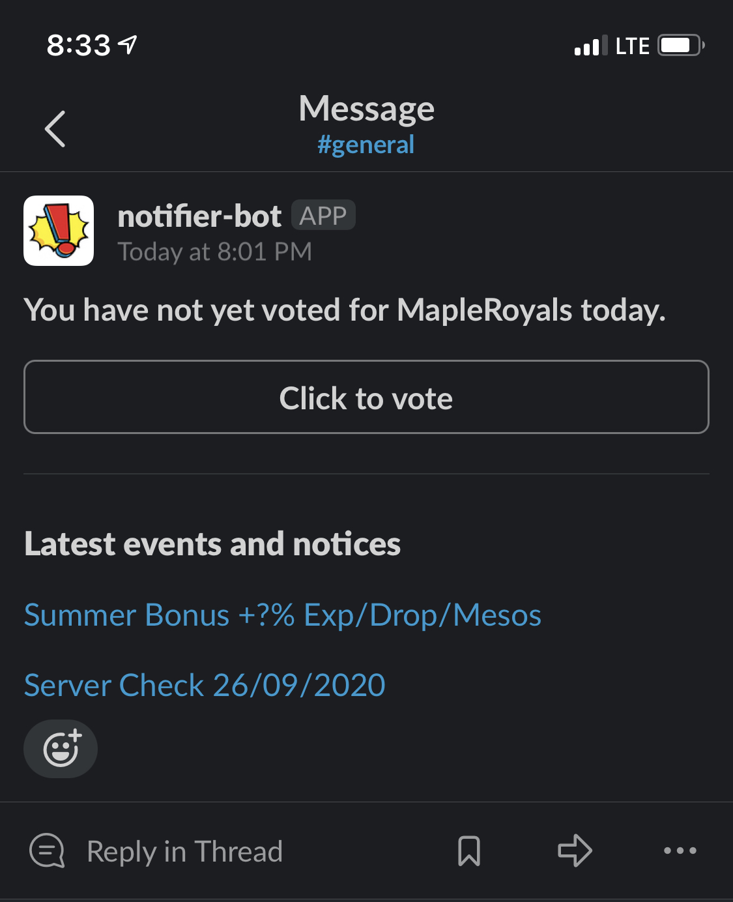

# MapleRoyals Vote Reminder

## Description

### Problem

This game allows "voting" for the server every 24 hours, which resets every day at midnight UTC. (Voting gives you a bit of in-game advantage).

Remembering to do this every day takes mental space unnecessarily.

### Purpose

Thus, the purpose of this script/service. At intervals, it checks if the user has voted, if they have not voted, then a message is sent to the user through a Slack webhook with the link. If they have already voted, then it will resume after the server time has reset at midnight UTC.

---

[](https://www.repostatus.org/#active)
[](https://drone.gordon-pn.com/gordonpn/mapleroyals-vote-reminder)


[](https://www.buymeacoffee.com/gordonpn)

## Screenshot

<a href="./docs/screenshot.jpeg"></a>

## Built with / technologies

Ruby 2.7.1

## Getting started (Development)

The entrypoint is `main.rb`, where a Dispatcher is instantiated.

Dispatcher controls the flow of the service depending if the user has voted or not.

The schedule times are randomized to avoid pinging the site at the same time every day.

### Prerequisites

Must have Ruby installed, 2.7+

### Configuration

Create a `.env` file with the following content:

```sh
USERNAME=
DEV=true
SLACK_NOTIFIER_URL=
HEALTHCHECK_UUID=
```

### Installing

Install the dependencies with `bundle install` or individually and system-wide with `gem install *`.

## Roadmap / Todo

[TODO](./TODO.md)

## Support

Open an issue!

## Authors

[Gordon Pham-Nguyen](https://github.com/gordonpn)

## License

[MIT LICENSE](./LICENSE)
